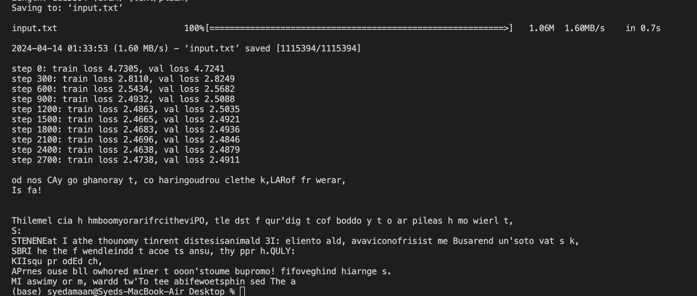

# Character-Level Bigram Neural Language Model for Sequential Text Prediction

## Tech Used
- **Programming Language:** Python 3.x
- **Machine Learning Framework:** PyTorch
- **Hardware Acceleration (Optional):** CUDA for GPU support

## Model Description
The Bigram Language Model is a rudimentary neural network that uses the current character to predict the next character in a sequence of text. This model is structured around a character-level embedding layer, which serves as a lookup table for generating the logits associated with the next character's probabilities.

## Training and Results

During training, the model outputs logs of train and validation losses at regular intervals. After training, you can see how well the model has learned to predict the next character by the quality of the text it generates.

Here is an example of the output after training the model:

### Architecture
- **Embedding Layer:** Maps each character to a corresponding logit for the subsequent character.
- **Forward Method:** Calculates logits and, if provided, the loss for a given set of target characters.
- **Text Generation Method:** Generates text by sampling from the probability distribution of the next character.

## Dataset
The model utilizes the "Tiny Shakespeare" dataset, which is a compilation of excerpts from the plays and writings of William Shakespeare. This dataset is automatically downloaded and preprocessed when the model script is executed.

## Training Process
The model follows a typical training regimen:
1. It generates random batches of sequences from the dataset.
2. For each batch, it computes the loss.
3. It performs backpropagation and optimization to adjust the model's weights.
4. The script logs the training and validation losses at defined intervals to monitor the learning process.

### Hyperparameters
- **Batch Size:** Defines the number of sequences processed simultaneously.
- **Block Size:** Sets the context length for predictions.
- **Learning Rate:** Determines the optimization step size.

## Performance Metrics
The script reports the loss on both training and validation datasets to provide an insight into the model's learning and generalization abilities.

## Generation of Text
Upon training completion, the model is capable of generating new text sequences, which are output to the console. These sequences are created by the model extending a given sequence with new characters it predicts.

## Limitations
The Bigram Language Model is basic by design, with inherent limitations due to its simplicity:
- **Simplicity:** It relies solely on the previous character to predict the next, lacking the sophistication of considering longer sequences.
- **Lack of Context:** It cannot capture long-term dependencies within the text, limiting the coherence of the generated content.
- **Educational Focus:** The model is designed as a teaching tool rather than a production-ready solution, ideal for understanding the fundamentals of neural network operations and text generation in PyTorch.

For those interested in building more capable and coherent text-generating models, exploring advanced neural network architectures, such as RNNs, LSTMs, and Transformers, is recommended.

## Requirements
To use this model, you must have Python 3.x and the latest version of PyTorch installed. Optional GPU support is available through CUDA.

## Setup and Execution
Follow these steps to start with the Bigram Language Model:
1. Install the required software.
2. Clone this repository.
3. Execute the model script to begin the training process automatically.
4. View the generated text output in the console after training.

## Contributions
Contributions to enhance the functionality or performance of this project are encouraged. This can include refining the model, expanding the dataset, or code optimization. Interested contributors can fork the repository, make their changes, and submit a pull request.

## Conclusion
While this Bigram Language Model offers a simple introduction to text generation with neural networks, it lays the groundwork for further exploration into more complex and effective models. It is a valuable resource for learning and experimentation in the field of NLP.

Explore, learn, and create!
